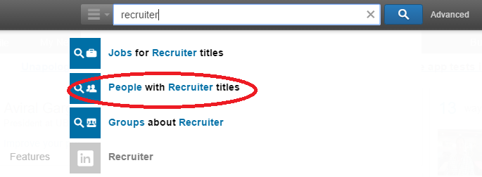
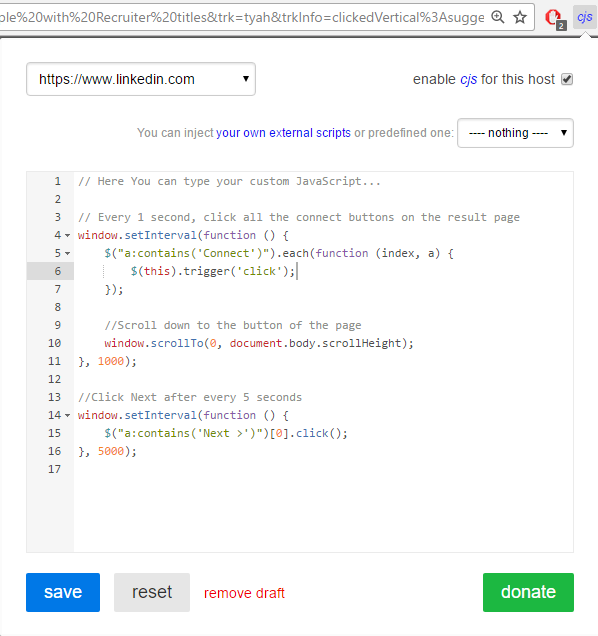

#LinkedIn-Connect
Script for a LinkedIn user to connect with all profiles in LinkedIn search page 

Software Requirements:
- Download chrome extension [Custom JavaScript for websites] (https://chrome.google.com/webstore/detail/custom-javascript-for-web/poakhlngfciodnhlhhgnaaelnpjljija)

Usage Example:

- Log in to linkedIn
- Type 'recruiter' in the LinkedIn searchbar
- Select "People with Recruiter titles"

- Copy all the code from app.js file
- Go back to LinkedIn window
- Click the button created by "Custom JavasScript for websites" extension on the top right
- Paste the code you copied earlier

- Click "Save button"

